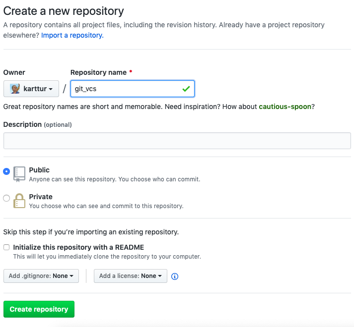
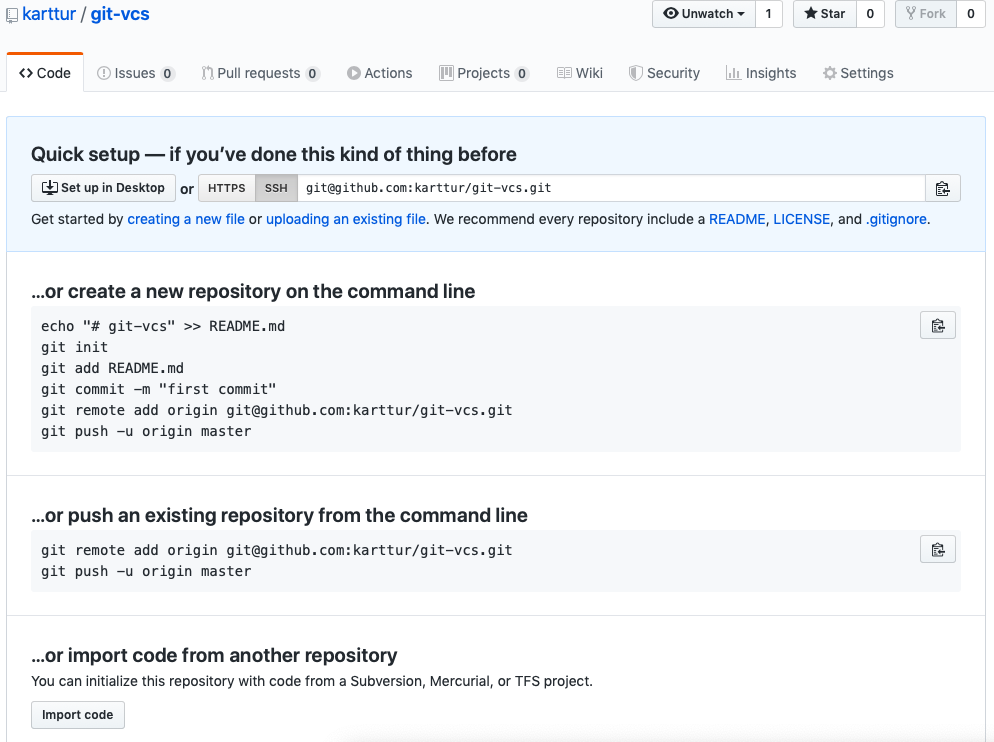

<script src="https://karttur.github.io/common/assets/js/karttur/togglediv.js"></script>

**NOTE, 1 October 2020 the label 'master' was replaced by 'main' for the default repo brach.**

## Introduction

This post is a manual on how to create and manage this blog ([git command line](https://karttur.github.io/git-vcs/)) using the local git command line tool.

## Prerequisits

You have to have a [GitHub](https://github.com) account, preferably set up to allow access using SSH, as outlined in the post on [Remote repositories with GitHub](../git-github). The content and layout of this blog is built using [Jekyll](https://jekyllrb.com), a static web-site generator. To follow this post you do not need to use Jekyll, but the trick is that [GitHub](https://github.com) is set up for handling Jekyll and create static web-pages (blogs for example) from Jekyll. And it is all for free. To learn about Jekyll, and how I created my blogs and pages, please see [Set up blog tools: Jekyll and Atom](https://karttur.github.io/setup-blog/) and [Setup Jekyll Theme Blog](https://karttur.github.io/setup-theme-blog/).

## Creating a new GitHub repo

You can only create an online GitHub repo using a browser while being logged in to your GitHub account. Explained in the GitHub page on [Creating a new repository](https://help.github.com/en/github/creating-cloning-and-archiving-repositories/creating-a-new-repository). However, you only need to create the repo, everything else can be done from your local command line as outlined on another of GitHub´s help pages [Adding an existing project to GitHub using the command line](https://help.github.com/en/github/importing-your-projects-to-github/adding-an-existing-project-to-github-using-the-command-line).

### Creating a new gh-pages blog repo

As an example of setting up and managing a repo after only creating it online, this post will take you through how to create a repo for _gh-pages_ - that is the GitHub system for free publishing of web-pages using [Jekyll](https://jekyllrb.com).

A GitHub repo for publishing must replace the default branch _master_  with a branch named _gh-pages_. Thus, the setup of _gh-pages_ using the local command line tool is a bit more complicated compared to setting up an ordinary repo with branches.

First you have to go to your online [GitHub](https://github.com) account and create a new repo. Just the repo name, nothing else, then click the <span class='button'>Create repository</span> button, as shown below.

<figure>

<figcaption> Github - Create a new repository.</figcaption>
</figure>

When the new repo is created, GitHub will show a page with hints on how to proceed with "Quick setup..." and other options. Before writing this blog I had a very vague idea about these hints. Now I know.

<figure>

<figcaption> Github - Hints after creating a new repository.</figcaption>
</figure>

### Create local repo

Open a <span class='app'>Terminal</span> window and change directory <span class='terminalapp'>cd</span> to the parent folder where you want to keep the local clone.


#### Alternative I

Create a new directory, the easiest is to name it identical with your newly created online repo:

<span class='terminal'>$ mkdir git-vcs</span>

<span class='terminalapp'>cd</span> to the new directory and initiate git:

<span class='terminal'>$ cd git-vcs<br>$ git init</span>

#### Alternative II

In the parent directory executue the commands:

<span class='terminal'>$ git init git-vcs<br>$ cd git-vcs</span>

### Configure repo

To get the new repo started, configure the repo user and email:

<span class='terminal'>$ git config user.name _repo-username_</span>

<span class='terminal'>$ git config \-\- user.email _email@example.com_</span>

Create an initial branch. You can choose to create either _master_ or _gh-pages_ (or a branch with any other name), but as you might end up with a _master_ branch let us first create _master_ and then replace it with _gh-pages_.

<span class='terminal'>$ git checkout -b master</span>

```
Switched to a new branch 'master'
```

If you check the branch of your local repo:

<span class='terminal'>$ git branch</span>

```
\* master
```

If no branch is reported, this is because you have not yet _staged_ and _committed_ any content.  You can then safely continue, just ignore that the branch name is not seen.

As noted above, for GitHub to be used for publishing web-pages, you need to replace _master_ with _gh-pages_, **not** create _gh-pages_ as a new branch from _master_. _gh-pages_  is thus an _orphan_ branch that takes the place of _master_. This is accomplished with the command:

<span class='terminal'>$ git checkout \-\-orphan gh-pages</span>

```
Switched to a new branch 'gh-pages'
```

If you rerun the command:

<span class='terminal'>$ git branch</span>

```
\* gh-pages
```
Again, if you have _commited_ nothing, you will not see the branch, but that is OK.

### Create some content

At this stage you need to create some content, either a complete jekyll page, or you can start with a README.md:

<span class='terminal'>$ pico README.md</span>

```
# blog on command line based git processing
```

Hit [ctrl]+[X] to exit <span class='terminalapp'>pico</span> and save the edits by pressing <span class='terminal'>Y</span> when asked.

### _stage_ and _commit_

_stage_ and _commit_ the changes you have made, they will belong the branch _gh-pages_:

<span class='terminal'>$ git add .<br>$ git commit \-m \'Created README.md\'</span>

```
[gh-pages (root-commit) aa6a314] Created README.md
 X files changed, Y insertions(+)
 create mode ...
 ...
```

Again try the command:

<span class='terminal'>$ git branch</span>

```
\* gh-pages
```

This time, gh-pages should be your only branch. If not, you need to delete other branches.

<span class='terminal'>$ git branch -d [branch]</span>

or to force delete if the branch contains un-megred changes:

<span class='terminal'>$ git branch -D [branch]</span>

### add remote

Your local account is not linked to any of your online GitHub repos. To link it, execute the command:

<span class='terminal'>$ git remote add origin git@github.com:"yourGitHubAccount"/git-vcs.git</span>

Before _pushing_ to our, completely empty, online GitHub repo, _stage_ and _commit_ any changes.

### git push

The local repo now contains a single branch, _gh-pages_, with some novel content that is _staged_ and _commited_. _push_ the content of the repo to your online account:

<span class='terminal'>$ git push origin gh-pages</span>

```
Enumerating objects: 95, done.
Counting objects: 100% (95/95), done.
Delta compression using up to 4 threads
Compressing objects: 100% (88/88), done.
Writing objects: 100% (95/95), 3.31 MiB | 3.68 MiB/s, done.
Total 95 (delta 4), reused 0 (delta 0)
remote: Resolving deltas: 100% (4/4), done.
To github.com:karttur/git-vcs.git
 * [new branch]      gh-pages -> gh-pages
```
As you see from the last line, you online GitHub repository got a new branch, _gh-pages_.

#### _stage_ and _commit_ changes

I created a complete suite of Jekyll pages, the blog you are looking at now. But I forgot to update my Jekyll configuration file, <span class='file'>\_config.yml</span>. I also added a figure and then this post is itself progressing for every new part I write. After completing these edits, I ran the following sequence of commands:

<span class='terminal'>$ git add .<br>$ git commit \-am \"initial updates\"<br>$ git push origin gh-pages</span>

```
[gh-pages 7e07cc9] initial updates
 3 files changed, 189 insertions(+), 3 deletions(-)
 create mode 100644 images/github-create-a-new-repo-git_vcs.png
(base) Thomass-MacBook-Air:git-vcs thomasgumbricht$ git push origin gh-pages
Enumerating objects: 14, done.
Counting objects: 100% (14/14), done.
Delta compression using up to 4 threads
Compressing objects: 100% (7/7), done.
Writing objects: 100% (8/8), 93.21 KiB | 15.53 MiB/s, done.
Total 8 (delta 5), reused 0 (delta 0)
remote: Resolving deltas: 100% (5/5), completed with 5 local objects.
To github.com:karttur/git-vcs.git
   aa6a314..7e07cc9  gh-pages -> gh-pages
```

It turned out that my documents had several spelling mistakes, and I also changed the names of all the posts. There are also some further posts I need to write. If you look at the online repo for this blog, you will thus see further _commits_.
